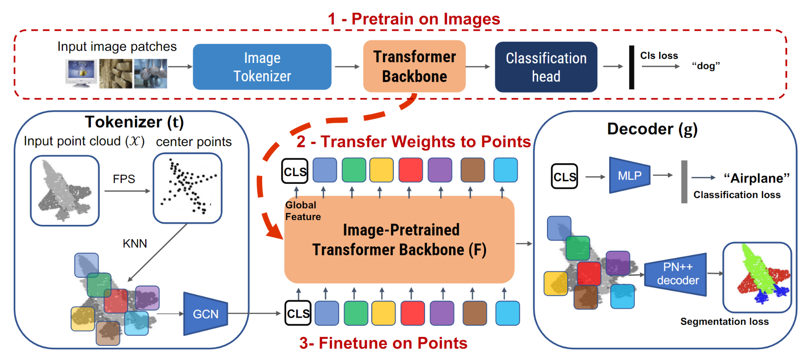

# Pix4Point
Official Implementation for paper `Pix4Point: Image Pretrained Transformers for 3D Point Cloud Understanding`

[arXiv](todo:arxivlink) | todo:arxivlink
## Setup environment
git clone this repository and install requirements:
```
git clone git@github.com:guochengqian/Pix4Point.git
cd Pix4point
bash install.sh
```

## Data preparation
ImageNet-1k dataset is used to pretrain Pix4point backbone.
You could download and extract ImageNet train and val images from http://image-net.org/.
The directory structure is the standard layout for the torchvision [`datasets.ImageFolder`](https://pytorch.org/docs/stable/torchvision/datasets.html#imagefolder), and the training and validation data is expected to be in the `train/` folder and `val` folder respectively:
```
/path/to/imagenet/
  train/
    class1/
      img1.jpeg
    class2/
      img2.jpeg
  val/
    class1/
      img3.jpeg
    class2/
      img4.jpeg
```
## Evaluation
To evaluate a pre-trained DeiT-base on ImageNet val with a single GPU run:
```
todo: command.
```
## Pretraining
To train a pre-trained PIx4point backbone on ImageNet:
```
todo: command.
```
## Finetuning
```
todo: command.
```
### Citation
If you are using our code in your work, please kindly cite the following:  
```
@inproceedings{qiu2018deeplidar,
  title={Pix4Point: Image Pretrained Transformers for 3D Point Cloud Understanding},
  author={Guocheng Qian, Xingdi Zhang, Abdullah Hamdi, Bernard Ghanem},
  publisher = {arXiv},
  year={2022}
}``` 

