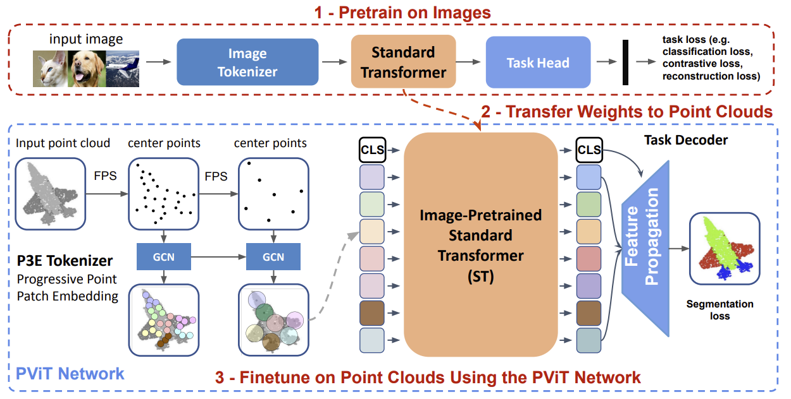

# Pix4Point
Webpage for paper `Pix4Point: Image Pretrained Transformers for 3D Point Cloud Understanding`

**Code is avaliable in https://github.com/guochengqian/PointNeXt, refer to [documentation](https://guochengqian.github.io/PointNeXt/projects/pix4point/) for training and testing details**

**Open an issue in https://github.com/guochengqian/PointNeXt if you have question regards to Pix4Point**. 

---
**Pix4Point: Image Pretrained Transformers for 3D Point Cloud Understanding**

### [arXiv](https://arxiv.org/abs/2208.12259) | [code](https://github.com/guochengqian/PointNeXt) | [doc](https://guochengqian.github.io/PointNeXt/projects/pix4point/)
*by [Guocheng Qian](https://www.gcqian.com/), [Xingdi Zhang](https://cindy-xdzhang.github.io/), [Abdullah Hamdi](https://github.com/ajhamdi), [Bernard Ghanem](https://www.bernardghanem.com/)*




**TL;DR:** We formulate a pipeline dubbed Pix4Point that allows harnessing pretrained
Transformers in the image domain to improve downstream point cloud tasks. 


**Abstract**: 
Pure Transformer models have achieved impressive success in natural language processing and computer vision. However, one limitation with Transformers is their need for large training data. In the realm of 3D point clouds, the availability of large datasets is a challenge, which exacerbates the issue of training Transformers for 3D tasks. In this work, we empirically study and investigate the effect of utilizing knowledge from a large number of images for point cloud understanding. We formulate a pipeline dubbed *Pix4Point* that allows harnessing pretrained Transformers in the image domain to improve downstream point cloud tasks. This is achieved by a modality-agnostic pure Transformer backbone with the help of tokenizer and decoder layers specialized in the 3D domain. Using image-pretrained Transformers, we observe significant performance gains of Pix4Point on the tasks of 3D point cloud classification, part segmentation, and semantic segmentation on ScanObjectNN, ShapeNetPart, and S3DIS benchmarks, respectively. Our code and models are available at [PointNeXt repo](https://github.com/guochengqian/pointnext). 

<p float="left">
  
  
</p>


# News
- :boom: Sep 2022, Code released in https://github.com/guochengqian/PointNeXt
-  :pushpin:  [Bernard Ghanem](https://www.bernardghanem.com/) is hiring visiting students. Monthly salary is paid with free housing. Contact Guocheng if interested: guocheng.qian@kaust.edu.sa


### Citation
If you are using our code in your work, please kindly cite the following:  
```
@inproceedings{qian2022pix4point,
  title={Pix4Point: Image Pretrained Transformers for 3D Point Cloud Understanding},
  author={Guocheng Qian, Xingdi Zhang, Abdullah Hamdi, Bernard Ghanem},
  publisher = {arXiv},
  year={2022}
}``` 

